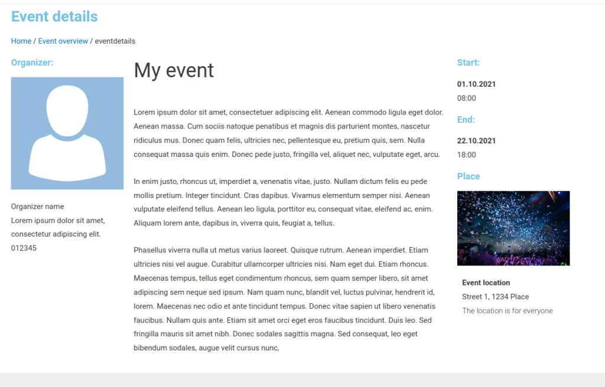

# Modern Events Calendar Lite - Detail pages

With this plugin you can select a normal page as an event detail page and you will get some Elementor compontents to show the event details.

## Requirements

* Modern Events Calendar Lite (https://webnus.net/modern-events-calendar/) by webnus
* Elementor (https://elementor.com/)

## Install

* Install MEC Lite and Elementor first
* Download and install this plugin (https://github.com/m1ga/mec_lite_detail_pages/releases)

## How to use it

* Go to `M.E. Calender - Custom detail page`
* Add the ID of your custom page
* Save the changes
* Now you can edit the linked page with Elementor and the `/events/eventID` links will link to that page.

### Elementor

* inside Elementor you will have a `MCE Lite Components` category with compontents for every event item
